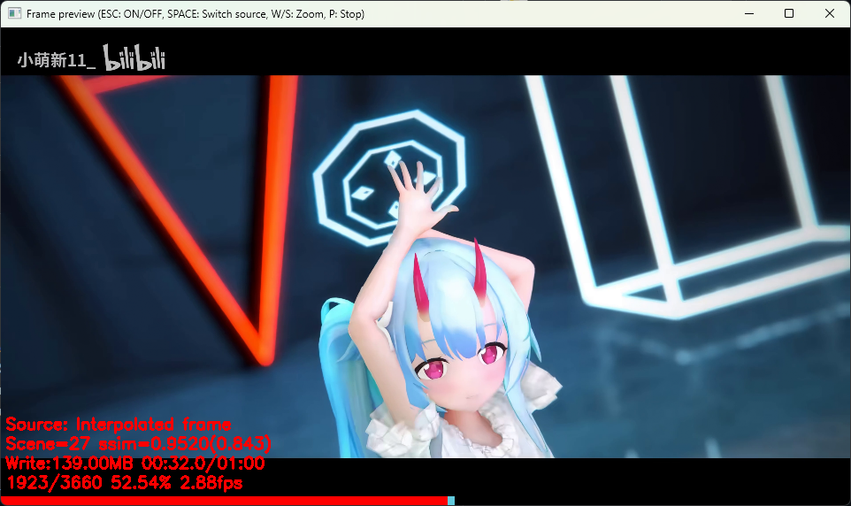
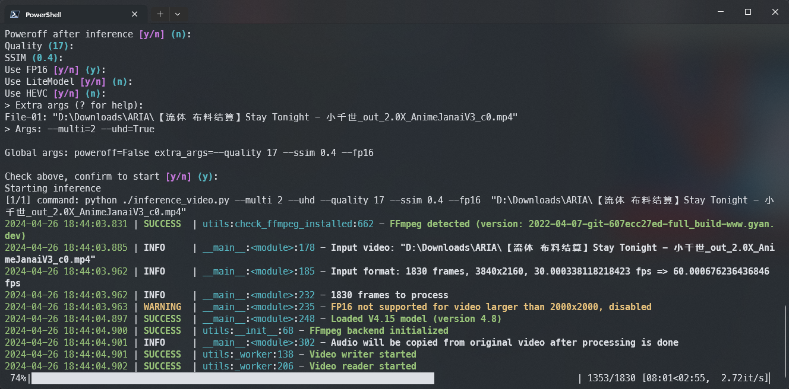

# Practical-RIFE

> [!IMPORTANT]
> **This fork is focused on improving the user experience when inference video**

Use `batch_inference.py` to interpolate multiple videos at once.

Or check `inference_video.py -h` for more options.

> [!NOTE]
> Current model version: V4.17

## Basic Usage

```bash
# Install dependencies (notice that this will install torch with CUDA support, better run in venv or conda)
python3 -m pip install -r requirements.txt

# Interpolate a video
python3 inference_video.py /path/to/video.mp4
```

## Screenshots




